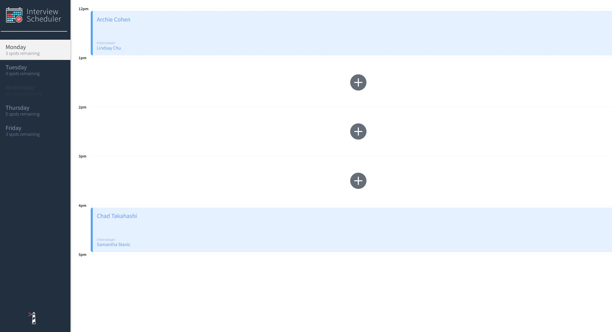
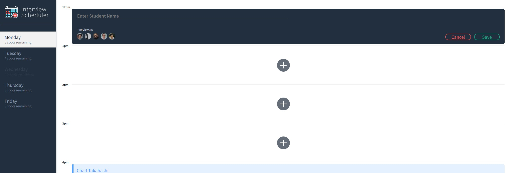
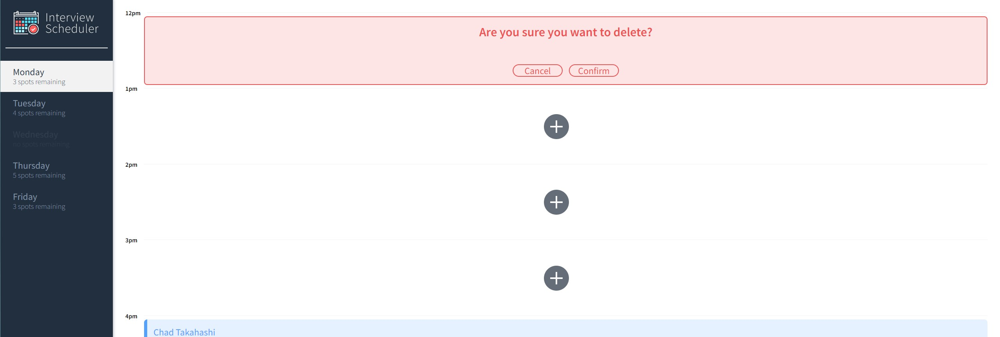

# Interview Scheduler

This is a single-page application built with React that allows users to book, edit and cancel interviews for each day of the week. 

## Screenshots 




## If you would like to run this application locally:
1. Fork this repo.
2. Go to the scheduler-api respository (https://github.com/John-Roxas/scheduler-api) that contains the database and fork it.
3. Install dependencies in both the scheduler and schedulerapi folder using the npm install command.
4. Open the two terminals, one for scheduler and scheduler-api.
5. Run both servers using the ```sh npm start``` command.
6. Go to http://localhost:8000/ in your browser.

Additionally, you can run the Jest tests framework in the scheduler folder using ```npm test``` in a separate terminal. There is also
several Storybook visual tests available that can be accessed using ```npm run storybook```.
